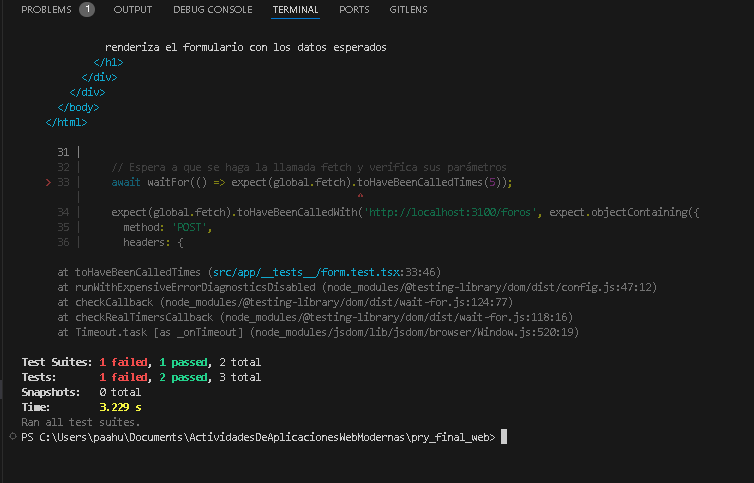

# GAMERS CONNECT


## Descripción del proyecto

En este proyecto, se busca desarrollar una aplicación web utilizando React y Node.js con TypeScript, enfocada en la creación de un foro sobre las últimas tendencias en videojuegos. La aplicación contará con una interfaz de usuario (frontend) interactiva y fácil de entender, y un backend robusto utilizando una API.

La finalidad del proyecto es ofrecer una plataforma donde los usuarios puedan agregar y consultar noticias relacionadas con videojuegos. La información será almacenada en una base de datos MySQL, gestionada a través de DBeaver, y todo el entorno de desarrollo será manejado y desplegado utilizando Docker Desktop para asegurar una fácil configuración y consistencia del entorno

## Estructura del proyecto

```sh
Estructura del Proyecto

Public

    public/

        logo2.jpg: Aquí se almacena el logo utilizado en la aplicación.

Src
    
    src/
        __test__/

            dash.test.tsx: Contiene la lógica para la parte del testing de parte del dashboard
            form.test.tsx: Contiene la lógica para la parte del testing de parte del formulario
        
        app/
            
            component/
                
                dash.tsx: Contiene la lógica y el diseño del dashboard donde se muestran los temas del foro.
                
                form.tsx: Contiene la lógica y el diseño del formulario donde los usuarios pueden agregar nuevos temas.
                
                dash.module.css: Archivo de estilos CSS para el dashboard.
                form.module.css: Archivo de estilos CSS para el formulario.
            
            form/

                page.tsx: Archivo principal que simplemente manda a llamar al componente del formulario.
        
        page.tsx: Archivo principal de la aplicación que manda a llamar al
        dashboard para ser visualizado en la página principal.

jest.config.ts: Este transformador tiene todas las opciones de configuración necesarias para que Jest funcione con Next.js

jest.setup.ts: Contiene el import '@testing-library/jest-dom';
```

Tal como se muestra en la siguiente imagen:


## Requisitos de instalación

Asegúrate de tener instalado y configurado Docker antes de comenzar.

- [Node.js](https://nextjs.org)
- [Docker](https://www.docker.com/products/docker-desktop/)
- [DBeaver](https://dbeaver.io)
- [Visual Studio](https://code.visualstudio.com/download)

## Instrucciones para la instalación de Frontend

1. Clonar el repositorio en la máquina local:
   
   ```sh
   git clone https://github.com/PauloMaza777/pry_final_web
   ```

2. Navegar al directorio del proyecto:
   
   ```sh
   cd pry_final_web
   ```

3. Ejecutar el siguiente comando para iniciar abrir el código en Visual Studio:

    ```sh
    code .
    ```
3. Ejecutar el siguiente comando para correr el programa en el localhost:

    ```sh
    npm run dev
    ```

    > **IMPORTANTE**
    >
    > Debe estar todo bien instalado y descargado, si no, mandara error 
    > cuando se corra el programa

5. El proyecto estará disponible en `http://localhost:3000`.

## Instrucciones para la instalación del Backend

1. Clonar el repositorio en la máquina local:
   
   ```sh
   git clone https://github.com/PauloMaza777/T4-01_Repositorio_del_proyecto2
   ```

2. Navegar al directorio del proyecto:
   
   ```sh
   cd node-restful
   ```

3. Ejecutar el siguiente comando para iniciar los contenedores en Docker Desktop:

    ```sh
    docker-compose up -d
    ```
3. Ejecutar el siguiente comando para bajar los contenedores con los volúmenes:

    ```sh
    docker-compose down -v
    ```

    > **IMPORTANTE**
    >
    > Debe estar iniciado el Docker engine para ejecutar el comando anterior,
    > si no lo está, se devolverá un mensaje de error indicando que no se
    > encontró el docker daemon.

5. La API estará disponible en `http://localhost:3100`.

## Prototipos de la vista y cómo utilizarlas (tipo manual)

A continuación, mostraremos los prototipos que se desarrollaron en este trabajo

Los mockups principales que tuve en mente al querer desarrollar esta aplicación fueron las siguientes:

1. Un simple mockup de un login para el usuario, sin embargo, no se pudo llevar a cabo


2. El formulario, donde el usuario tendría la interacción de poder introducir datos de forma simple, en donde se guardaran en una base de datos MySql utilizando una apí que fue elaborada en el semestre pasado en la materia de ARQUITECTURAS Y SERVICIOS WEB AVANZADOS


3. El dashboard que nos servirá como pantalla principal en donde el usuario podrá ver las consultas que se generaron al guardado de los datos, implementando una serie de parámetros como contenedores, imágenes, títulos, descripción, nombre del autor etc.


6. En esta imagen podemos ver como el contenedor en Docker funcionará correctamente cuando lo ponemos en línea


5. En esta imagen mostramos como se ve el llenado de un tema en el formulario, llenando los campos de titulo, autor del tema, fecha en la que es publicada y una pequeña descripción de lo que trata el tema con 2 botones para agregar y regresar a la página principal


7. En esta imagen mostramos el mensaje de confirmación que nos dice que el tema se agregó correctamente


8. Y por último la imagen donde nos muestra el tema agregado correctamente con todos los parámetros que le mandamos anteriormente


## Descripción de las pruebas y cómo ejecutarlas.

Ejecución de las pruebas

```sh
npm run test
```

fue el comando que utilizamos para correr el testing una vez que hayamos acabado

para antes de eso, tuvimos que haber importado e instalado todas las dependencias que nos ayudaron a realizar este proyecto

1. Prueba de testeo, 2 confirmados, 1 erroneo

## URL de despliegue en Vercel.
